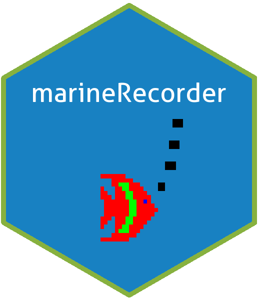

```{r, echo = FALSE}
knitr::opts_chunk$set(
  collapse = TRUE,
  comment = "#>",
  fig.path = "man/figures/README-"
)
```

# `marineRecorder` Package 

A Marine Recorder R Package was developed to work with the marine recorder snapshot. The functions included in this package create shapefiles and check species, which can be linked to the species dictionary (a separate database used with the main application). 

### Installation of `marineRecorder` Package

``` {r, echo=TRUE, results="hide", message=FALSE, eval= FALSE}
# install.packages("devtools")
library("devtools")
devtools::install_github("jncc/marine-recorder-tools", subdir = "marineRecorder")
```

### List of functions currently available:

* **MR_GIS_Sample()** - creates a shapefile of samples from the snapshot
* **MR_GIS_Species()** - creates a shapefile of species from the snapshot
* **addParentAphiaIDs()** - adds parent aphia IDs as records to the data frame
* **addValidAphiaIDs()** - adds valid aphia IDs, if valid aphia IDs are missing from the data frame
* **createShortcodes()** - creates short codes, first three letters of the first and second word from a given string
* **getParentID()** - finds out the aphia ID of parent 
* **missingParentAphiaIDs()** - identifies the missing parent aphia IDs from the data frame
* **missingValidAphiaIDs()** - identifies the missing valid aphia IDs from the data frame
* **updateParentAphiaIDs()** - updates parent aphia ID records


### Examples

#### 1. MR_GIS_Sample(), MR_GIS_Species()

To use these function you will need to use the **32-bit version** of R, for RODBC to connect to the Access database. To change the version of R you are using in RStudio:

1.  Click the '**Tools**' tab at the top of your RStudio window
2.  Click on '**Global Options**'
3.  Click on '**General**' tab in the left hand sidebar
4.  Click '**Change**' under the '**R version:**' section
5.  Click on '**Use your machine's default version of R (32-bit)**' and Click '**OK**'
6.  A dialog box '**Change R Version**' will open stating '**You need to quit and re-open RStudio for this change to take effect.**'
7.  Click '**OK**'
8.  Click '**Apply**' followed by '**OK**'
9.  Close and re-open RStudio
10. Call the `marineRecorder` package to the global environment using `library(marineRecorder)`

Also, to use this function you will need to download the Marine Recorder Snapshot available to download from the [JNCC Marine Recorder webpage](http://jncc.defra.gov.uk/page-1599). Once downloaded extract the Snapshot Access Database and copy into your working directory.

**N.B.** These functions still use the 'sp' package and so the functions may take a while to run.  

```{r, echo=TRUE, results="hide", message=FALSE, eval= FALSE}
#find and paste snapshot filepath 
filepath <- "SnapshotDatav51_Public_20180524.mdb"

#write down the version - usually the same as the file name
version <- "SnapshotDatav51_Public_20180524"

#run function MR_GIS_Sample
Sample <- MR_GIS_Sample(snapshot_filepath = filepath, snapshot_version = version)
#the following will be printed in the R Console 
#[1] "The shapefile ' C2018-07-30_Sample_SnapshotDatav51_Public_20180524 ' 'has been saved to your working directory."

#run function MR_GIS_Species
Species <- MR_GIS_Species(snapshot_filepath = filepath, snapshot_version = version)
#the following will be printed in the R Console 
#[1] "The shapefile ' C2018-07-30_Species_SnapshotDatav51_Public_20180524 ' 'has been saved to your working directory."


```


#### 2. Adding and finding missing valid aphia IDs

These two functions find whether there are any missing valid aphia IDs missing from the data frame and adds them in. These examples can also be found in the function help page.

```{r, echo=TRUE, results="hide", message=FALSE, eval= FALSE}
data(marineKingdoms)

#Run missingValidAphiaIDs function to check if any Valid Aphia ID records are missing from the dataset.
missingValidAphiaIDs(marineKingdoms)
#[1] 6
# Aphia ID 6 is a valid AphiaID for a record but is missing from the dataset. Use 'addValidAphiaIDs' function to enter this record.

#run add valid IDs function
x <- addValidAphiaIDs(marineKingdoms)
#Added Aphia ID records: 6
#1 new records have been added.

# Aphia ID 6 is a valid Aphia ID but is not in the dataset as an individual record.

#Run to check if there any more missing valid AphiaID records
missingValidAphiaIDs(x)
#[1] "All valid aphiaIDs are also individual records"

```


#### 3. Adding, updating and finding missing parent aphia IDs

These functions find out what the parent aphia ID of given aphia ID is (getParentID), finds out if any parent aphia IDs are missing from the data frame (missingParentAphiaIDs), adds in parent aphia ID records (addParentAphiaIDs) and update the parent aphia IDs (updateParentAphiaIDs).

All these examples can be found on the help page of the given function. 


```{r, echo=TRUE, results="hide", message=FALSE, eval = FALSE}

# Enter aphia ID - Animalia (2)
getParentID(2)
#[1] 1

data(marineKingdoms)
#run add parents function
u <- addParentAphiaIDs(marineKingdoms)

#check for missing parents as individual records
missingParentAphiaIDs(u)
# Error in missingParentAphiaIDs(u) :
#  Some Parent AphiaIDs are NA. Re- run 'updateParentAphiaIDs' function.

#Run update parent IDs function
v <- updateParentAphiaIDs(u)

#check for missing parents as individual records
missingParentAphiaIDs(v)
#[1] "All parent aphiaIDs are also individual records."
```


#### 4. Create Shortcodes

This function creates an abbreviation of a given string.

```{r, echo=TRUE, results="hide", message=FALSE, eval = FALSE}
# Enter a string
createShortcodes("Salmo salar")
#[1] "Salsal"
```


### Dependencies

* [RCurl](https://cran.r-project.org/web/packages/RCurl/index.html)
* [RODBC](https://cran.r-project.org/web/packages/RODBC/index.html)
* [daff](https://cran.r-project.org/web/packages/daff/index.html)
* [dplyr](https://cran.r-project.org/web/packages/dplyr/index.html)
* [rgdal](https://cran.r-project.org/web/packages/rgdal/index.html)
* [sp](https://cran.r-project.org/web/packages/sp/index.html)
* [sqldf](https://cran.r-project.org/web/packages/sqldf/index.html)
* [stringr](https://cran.r-project.org/web/packages/stringr/index.html)
* [worms](https://cran.r-project.org/web/packages/worms/index.html)
