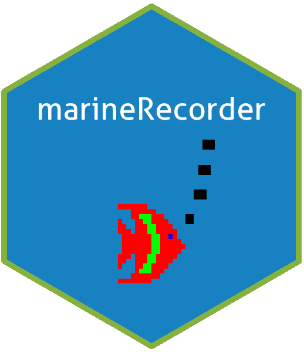

# `marineRecorder` Package 

A Marine Recorder R Package was developed to work with the snapshot. The R package contains functions to work with the snapshot by creating shapefiles, checking for new surveys and checking the species in the species dictionary (a separate database used with the main application).

### Installation of `marineRecorder` Package

``` r
# install.packages("devtools")
library(devtools)
devtools::install_github("jncc/marine-recorder-tools", subdir = "marineRecorder")
```

### List of functions currently available:

* MR_GIS_Sample() - creates a shapefile of the samples from the snapshot
* MR_GIS_Species() - creates a shapefile of the speices from the snapshot
* addParentAphiaIDs() - adds parent aphia IDs as records to the dataframe
* addValidAphiaIDs() - adds valid aphia IDs, if valid aphia IDs are missing from the dataframe
* createShortcodes() - creates shortcodes, first three letters from the first and second word from a given string
* getParentID() - finds out the aphia ID of parent 
* missingParentAphiaIDs() - identifies the missing parent aphia IDs from the dataframe
* missingValidAphiaIDs() - identifies the missing valid aphia IDs from the dataframe
* updateParentAphiaIDs() - updates parent aphia ID records


### Dependencies

* [RCurl](https://cran.r-project.org/web/packages/RCurl/index.html)
* [RODBC](https://cran.r-project.org/web/packages/RODBC/index.html)
* [daff](https://cran.r-project.org/web/packages/daff/index.html)
* [dplyr](https://cran.r-project.org/web/packages/dplyr/index.html)
* [rgdal](https://cran.r-project.org/web/packages/rgdal/index.html)
* [sp](https://cran.r-project.org/web/packages/sp/index.html)
* [sqldf](https://cran.r-project.org/web/packages/sqldf/index.html)
* [stringr](https://cran.r-project.org/web/packages/stringr/index.html)
* [worms](https://cran.r-project.org/web/packages/worms/index.html)

